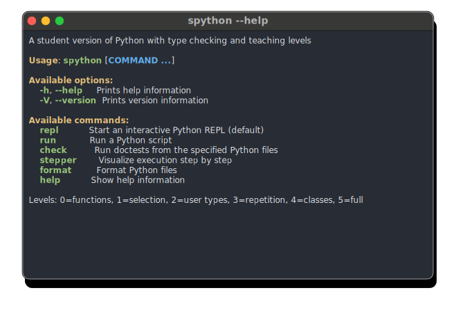

# spython

A Python interpreter with integrated type checking, designed for teaching typed
Python. It enforces complete type annotations before running code and
progressively unlocks language constructs through teaching levels.

spython is built on [RustPython](https://github.com/RustPython/RustPython) for
execution and [ty](https://github.com/astral-sh/ty) (from ruff) for type
checking. A similar project for Gleam is
[sgleam](https://github.com/malbarbo/sgleam).

## Features

- **Type checking before execution** — all code is type-checked before it runs
- **Doctest support** — doctests are type-checked and executed
- **Teaching levels** — progressively unlock Python constructs (functions →
  selection → types → repetition → classes → full)
- **Annotation enforcement** — every function parameter, return type, and
  class variable must be annotated
- **Image library** — built-in SVG-based graphics library for teaching,
  inspired by [HtDP](https://htdp.org/) image teachpacks
- **Interactive REPL** — syntax highlighting, auto-indent, tab completion
- **WASM support** — runs in the browser via a WASM build


## Samples

<p align="center">
  <picture>
    <source media="(prefers-color-scheme: dark)" srcset="docs/spython-dark.svg" />
    <source media="(prefers-color-scheme: light)" srcset="docs/spython-light.svg" />
    
  </picture>
</p>

## Build

Requires Rust (stable). Dependencies are fetched automatically.

```bash
cargo build                # debug build
cargo build --release      # optimized build
```

## Usage

```bash
# Run a script (type-checked)
spython run file.py

# Run with a specific teaching level (0-5)
spython run --level 3 file.py

# Type-check and run doctests (no main execution)
spython check file.py

# Start the REPL
spython
```

## Teaching Levels

| Level | Name       | Allows                                                            |
| ----- | ---------- | ----------------------------------------------------------------- |
| 0     | Functions  | `def`, `return`, scalars, string indexing                         |
| 1     | Selection  | `if`/`elif`/`else`                                                |
| 2     | User types | `class` (Enum / `@dataclass`), `match`                            |
| 3     | Repetition | `list` literals, `for`, `while`, `+=`                             |
| 4     | Classes    | full `class` with methods, `dict`/`set`, comprehensions, `lambda` |
| 5     | Full       | unrestricted (only annotations still required)                    |

Levels 0 through 3 also apply extra restrictions aimed at common beginner
mistakes (all lifted at level 4): conditions must be boolean, `bool` is
not allowed in arithmetic, chained comparisons are rejected, expression
statements whose result is discarded are rejected, and function parameters
cannot have default values.

## Standard Library

spython ships with a minimal subset of the Python standard library. The goal is
for students to focus on fundamentals — algorithms, types, and problem-solving —
without relying on ready-made solutions from large libraries.

Available modules: `dataclasses`, `enum`, `typing` and `math`.

The built-in `spython.image` and `spython.world` modules are also available
(see below).

Most other standard library modules (`os`, `re`, `json`, `random`, etc.) are
**not** available: importing them will produce an error.

## Image Library

spython includes a built-in image library for teaching graphics programming,
inspired by the [HtDP](https://htdp.org/) image teachpacks. Images are
rendered as SVG.

Everything is imported from `spython.image` (colors, styles, shapes, and
functions) and `spython.world` (animations):

```python
from spython.image import circle, overlay, rectangle, fill, stroke, to_svg, red, blue

image = overlay(circle(30, stroke(red)), rectangle(80, 50, fill(blue)))
```

The library provides:

- **Shapes** — rectangles, circles, ellipses, triangles (7 constructors),
  polygons, stars, lines, wedges, bezier curves
- **Transformations** — rotate, scale, flip, crop
- **Composition** — overlay, underlay, beside, above (with alignment options)
- **Scenes** — place images at coordinates, draw lines/polygons/curves
- **Text and fonts** — text rendering with customizable fonts
- **Styles** — fill and stroke with color, opacity, width, dash patterns
- **Colors** — 140+ CSS named colors, `rgb()`, `rgba()`
- **Animation** — `World` class for interactive programs, `animate` for
  frame-based animation

## Architecture

The workspace has three crates:

- `engine` — shared library (checker, completion, FFI)
- `cli` — CLI binary with REPL
- `wasm` — WASM target for browser use

## Development

```bash
make check              # clippy + fmt + ruff format
cargo test --workspace  # all tests
make wasm               # build WASM binary
```

## License

MIT — see [LICENSE](LICENSE).
